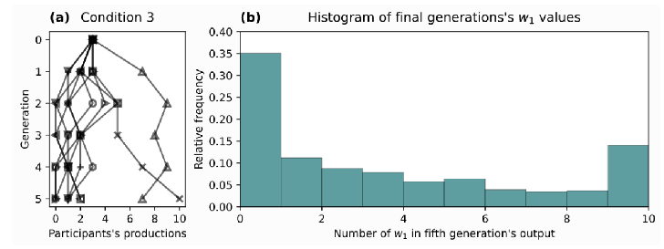

# examples
Examples of code and analyses. Files included:

Report 1 (2021).Rmd & Report 2 (2021).Rmd
- Reports based on coursework, analysing data for psychological research

findsubstring.py
- A script which finds the smallest substring from a longer string of text

json_to_csv.py
- A script I wrote and used for my Big Data project

synthesiser.py
- Final assignment for a Linguistics course

